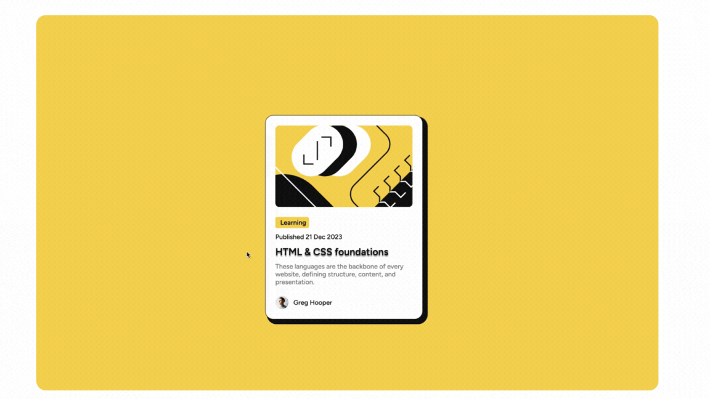

# Frontend Mentor - Blog preview card solution

This is a solution to the [Blog preview card challenge on Frontend Mentor](https://www.frontendmentor.io/challenges/blog-preview-card-ckPaj01IcS). Frontend Mentor challenges help you improve your coding skills by building realistic projects.

## Table of contents

- [Overview](#overview)
  - [The challenge](#the-challenge)
  - [Screenshot](#screenshot)
  - [Links](#links)
- [My process](#my-process)
  - [Built with](#built-with)
  - [What I learned](#what-i-learned)
  - [Continued development](#continued-development)
  - [Useful resources](#useful-resources)
- [Author](#author)
- [Acknowledgments](#acknowledgments)

## Overview

### The challenge

Users should be able to:

- See hover and focus states for all interactive elements on the page

### Screenshot



### Links

- Solution URL: [Add solution URL here](https://your-solution-url.com)
- Live Site URL: [Add live site URL here](https://your-live-site-url.com)

## My process

### Built with

- Semantic HTML5 markup
- CSS custom properties
- Flexbox
- Mobile-first workflow

### What I learned

Through this project, I enhanced my understanding of HTML and CSS, particularly in using custom properties and managing hover states effectively. Below are some examples of code that I am proud of:

```html
<h2 class="title">HTML & CSS foundations</h2>
```

```css
.title:hover {
  cursor: pointer;
  color: var(--primary-yellow);
  background-image: linear-gradient(
    to right,
    #23abd4,
    var(--neutral-grey) 50%,
    var(--neutral-white) 50%
  );
  background-size: 200% 100%;
  background-position: -100%;
  transition: all 0.8s ease-in-out;
  text-shadow: 0 0 0 var(--primary-yellow);
}
```

### Continued development

In future projects, I aim to focus more on:

- Enhancing responsive design techniques
- Implementing advanced CSS animations
- Improving accessibility features

### Useful resources

- [CSS-Tricks](https://css-tricks.com) - A great resource for various CSS techniques and tips.
- [MDN Web Docs](https://developer.mozilla.org) - Comprehensive documentation on web technologies including HTML and CSS.

## Author

- Frontend Mentor - [@Patrycja-dz](https://www.frontendmentor.io/profile/Patrycja-dz)

## Acknowledgments

Special thanks to the Frontend Mentor community for providing valuable feedback and support throughout this challenge.
